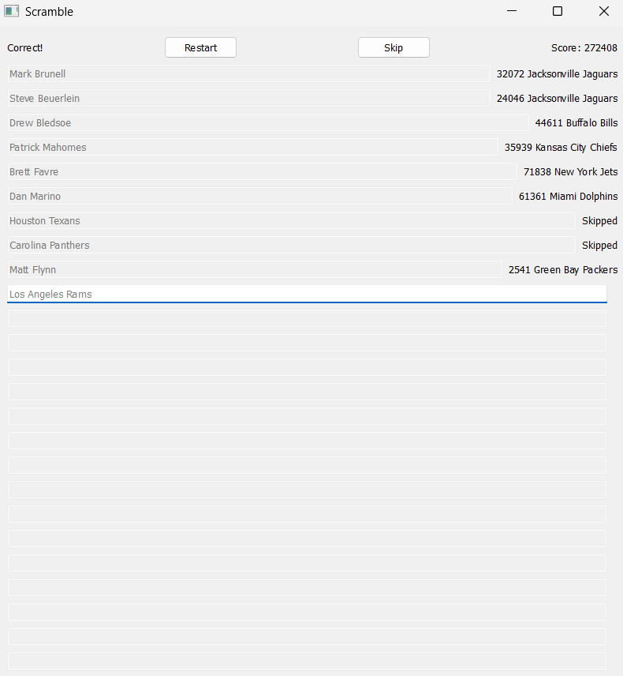

# Scramble

[](https://github.com/mrp5623/scramble/actions/workflows/tests.yml)

**The Game**: A desktop trivia game where you're shown a random NFL
franchise and have to name a quarterback who took a snap for them at any point in their career, without replacement. Each correct QB adds their TOTAL career passing yards to your score across 25 rounds. A local leaderboard tracks the best runs.

**The Experiments**: A reinforcement learning study to determine the optimal game strategy (see **Why?: The Experiments** below).



## Download & Play (Windows)

No build required — grab the latest release, unzip, and play:

1. Download **`scramble-windows-x64.zip`** from the [latest release](https://github.com/mrp5623/scramble/releases/latest).
2. Unzip it anywhere.
3. Open the `scramble-windows-x64` folder and double-click **`scramble.exe`**.

Everything the game needs (the Qt runtime and the dataset) is inside the folder, so it runs fully offline. On first launch Windows SmartScreen may warn about an unknown publisher — the build isn't code-signed — so choose **More info → Run anyway**.

## Why?: The Game
I got the idea for Scramble in my senior year of high school after seeing a TikTok trend of NFL fans playing a game of the same premise using a team-randomizer filter. The video I'd seen had a lower number of rounds and an arbitrary score the creator was trying to pass. I was able to beat it in a few attempts, so I upped the number of rounds and the score which made me realize how quickly the difficulty could stack with a no-replacement rule. Eventually I found it tedious to continue playing with pieces of paper, a TikTok filter, and having to Google each player's exact yards after each game, so during a boring class at school I built the game in Google Sheets with an automatic randomizer and score adder, and I used my previous knowledge of statistic scraping from my [NFL QB Record Tracker](https://github.com/mrp5623/nfl_qb_record_tracker) to implement an answer validator and automatically load in the score of correct guesses. I set the number of rounds at 25 and the score bar at 1.2 million yards and shared it with my most knowledgeable friends as a challenge. As we played more, we learned more, and eventually I moved the bar up to 1.3 million which proved to be much more challenging...

When I learned my upcoming Advanced Programming Fundamentals course at UF would be teaching C++, which I had no experience in, I decided to convert the Google Sheet into a full C++ desktop game both as practice and to save the game before my high school deleted my Google account. I did not have the experience to know C++ UI/UX is awful, which is why the game looks like it was made before I was born (planning to fix soon!). I also had to remove the automatic scraping of team files when the website I used to generate them started using Cloudflare. 

## Why?: The Experiments
As I said, after learning rosters and yard counts from a few dozen rounds of play, most of my friends were able to surpass the 1.2 million score bar I'd set for them. Before long, most of them had joined me in chasing 1.3 million. Soon we were talking our strategies at the lunch table and something interesting emerged. When going after 1.2 million and still learning, it was easiest to just put the best available player we knew for each team. However, another friend and I had multiple rounds during the 1.3 million chase where we'd been so close, just to get screwed at the end by having to put a low-yardage QB because we'd used up the better options earlier. Independently, we had both begun experimenting with saving certain QBs even when they were the best option for the current team because that team had a pretty close next option and the top player was FAR better than the next best option on a different team that may appear in the future. After some time refining this strategy, we both broke the elusive 1.3 million mark. 

When I learned more about the capabilities of machine learning during my first year at UF, my mind wandered back to this project. Though our saving strategy had won the race to 1.3 million, the loyalists to the 'best option' strategy within our group had a good point: We knew the highest POSSIBLE score was greater than 1.3 million, so their strategy would pass the bar in at least one of the $32^{25}$ possible sequences of teams. Saving introduced a new variable that might even lead to us missing out on a winning run by being too fancy. I wanted to see if I could prove that the saving strategy was optimal, and if an RL agent trained on thousands of rounds of the game would pick up on greedy, saving, or possibly something none of us had even considered.

### Key Results

- **Greedy is nearly optimal** for raw score — 98.1% of a clairvoyant offline optimum.
- **But for the goal actually played** (clearing 1.3M yards), a mild "saving" strategy
  is provably better: +25% more likely to hit the threshold than greedy.
- **A from-scratch RL agent rediscovers this unaided.** With no teacher and no reward
  shaping, a REINFORCE agent trained on ~192k games learns to beat greedy by a
  statistically significant margin (+2,959 yards/game, t = 14.1, n = 3,000 paired games).

The full findings are detailed in the [report](docs/experiments/REPORT.md) in this repo.

## How it works

The game reads a bundled dataset (`data/nfl_qbs.json`) mapping each franchise
to its quarterbacks and their career passing yards. It runs fully offline, no network access at play time.

## Build

Prerequisites:
- A C++20 compiler
- Qt5 (Widgets)
- CMake 3.10+
- vcpkg (for Qt5 on Windows)

```bash
cmake -S . -B build -DCMAKE_TOOLCHAIN_FILE=<path-to-vcpkg>/scripts/buildsystems/vcpkg.cmake
cmake --build build --config Debug
```

Run `build/Debug/scramble.exe`. The build copies `data/` next to the
executable automatically.

### Packaging a release

To produce the self-contained zip that gets attached to a GitHub release:

```bash
cmake --build build --config Release --target package
```

This writes `build/scramble-windows-x64.zip` — the executable bundled with its
Qt runtime, plugins, and `data/` — ready to unzip and run on any Windows machine
with no toolchain installed.

## The stats

`data/nfl_qbs.json` is a static snapshot of career passing yards, generated offline, which sums each quarterback's franchise totals across cached Pro-Football-Reference team pages. Those cached pages aren't committed (and PFR now blocks automated scraping), so updating the dataset would currently be manual.

## Project layout

| Path | Purpose |
|------|---------|
| `main.cpp`, `scramblewindow.*` | Qt UI |
| `scramble.*` | Game logic and dataset loading |
| `team.*` | Team value type |
| `data/nfl_qbs.json` | Bundled game data |
| `experiments/` | RL agent, baselines, simulator, and tests (the study) |
| `docs/experiments/REPORT.md` | Full experiment write-up and findings |

## What's next
- Redesign for web (ditch C++ front end)
- Online leaderboard
- Way to watch the different policies play the game in the actual application
- Way to let players see how each policy would've played their last game differently from them

## License

MIT — see [LICENSE](LICENSE).
