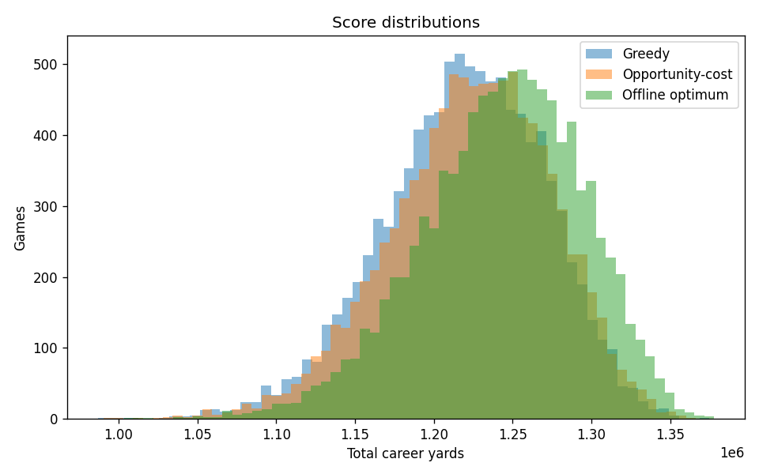
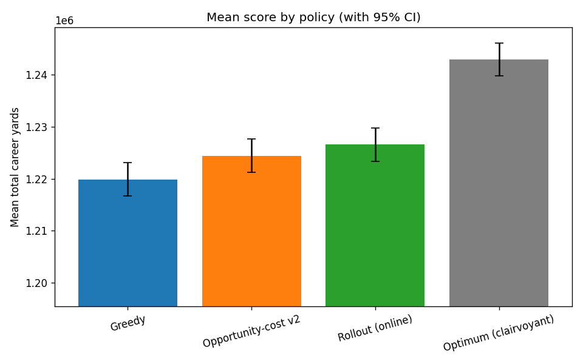
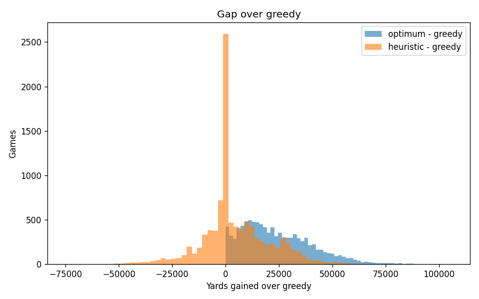
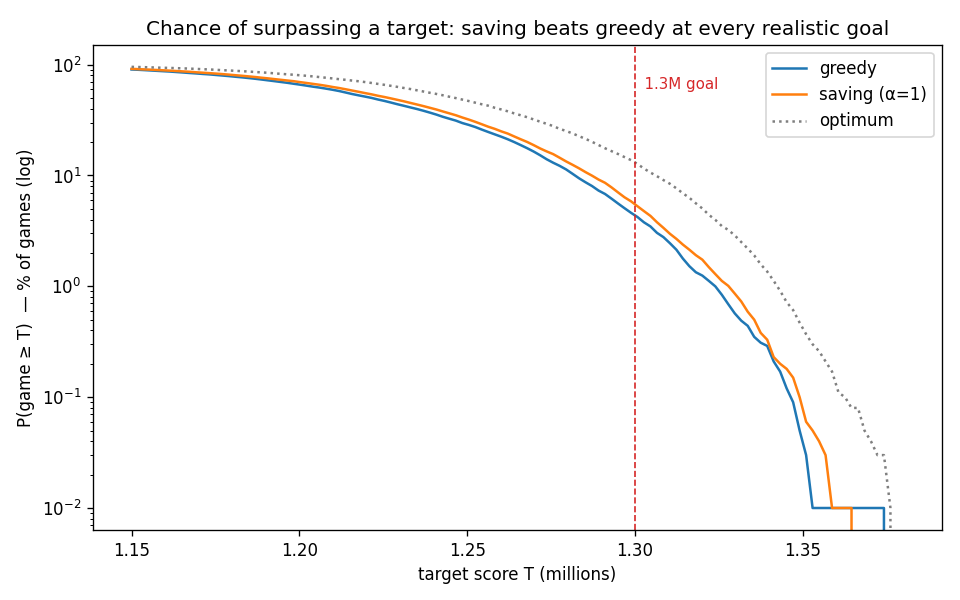
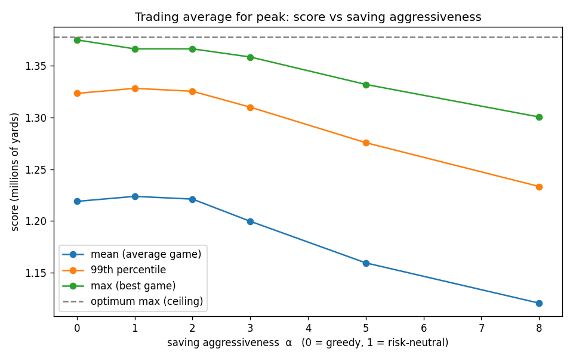
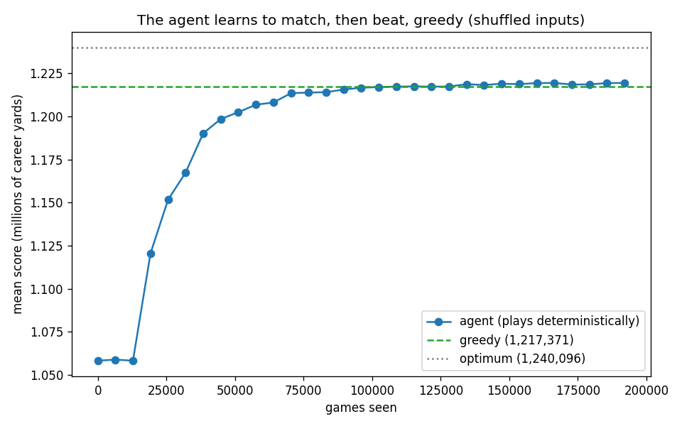
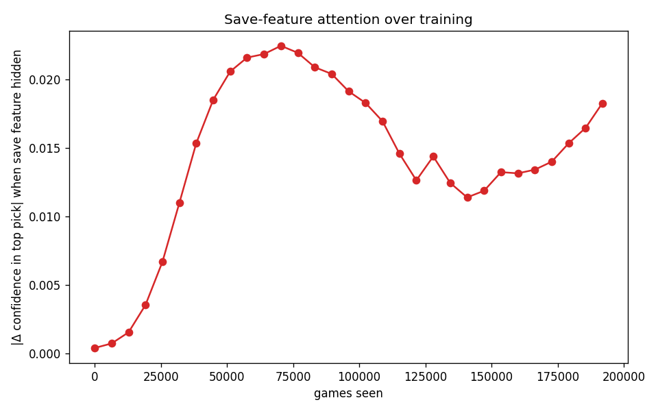
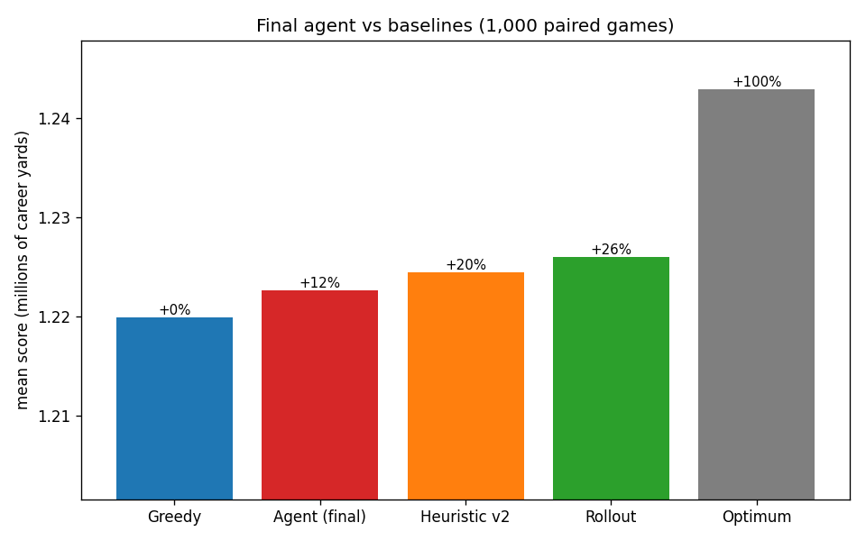

# Is Greedy Optimal in Scramble? A Simulation and Reinforcement-Learning Study

## Abstract

Scramble is a 25-round game: each round shows a random NFL franchise and you name a quarterback who played for it, scoring his full career passing yards, with each QB usable only once. Playing it, I developed a "saving" strategy (holding a multi-team QB for a better future franchise rather than spending him now) while chasing a 1.3-million-yard goal, and set out to test whether that intuition was right and whether an agent could learn it. Two results follow. First, **greedy** (always take the highest-yardage legal QB) is very close to optimal: it scores **98.1%** of a clairvoyant offline optimum, and no online policy beats it by more than **~0.55%**. However, for the goal actually played, a score threshold, **mild saving is the better strategy**: it is **~25% more likely to clear 1.3M** and wins at every realistic target. Given enough games, greedy will achieve a higher leaderboard score, but on average saving scores better. Second, a from-scratch reinforcement learning agent, given a variance-cancelling reward and enough training, **rediscovers the saving strategy unaided and beats greedy** by a small but statistically decisive margin (**+2,959 yards, t = 14**), capturing about two-thirds of a hand-coded heuristic's edge.

## 1. Background

Scramble is played over 25 rounds. Each round draws one of the 32 NFL franchises uniformly at random (with replacement) and asks for a quarterback who took a snap for that franchise at any point in his career. A correct answer scores that QB's entire career passing yards, and each QB may be used only once per game. Because a QB's full career total counts for any franchise he played for, a multi-team passer is a powerful asset, which creates the game's central complexity and strategy question: spend your best available QB now, or save him for a future franchise where he would be worth more relative to the alternatives.

When my friends and I played, the objective was not the highest average or technically even total score, but a hard threshold: surpassing 1.3 million yards. Two of us independently theorized that saving multi-team QBs was how we finally cleared it. That motivates two questions:

1. **Is greedy optimal, and does saving actually help clear 1.3M?** Maximizing P(score ≥ 1.3M) is a *threshold* objective, distinct from both the mean and the single all-time record.
2. **Can a from-scratch reinforcement-learning agent discover the optimal strategy on its own, and how many games does it take to reach a stable one?**

## 2. Methods

### 2.1 The game and simulator

A Python simulator reproduces the game exactly: 25 rounds, teams drawn randomly with replacement from the 32 franchises, scoring by career passing yards, QBs consumed on use. The roster (each franchise → its QBs → career yards) is built offline from Pro-Football-Reference team passing pages, with a QB's career total taken as the sum of his franchise yards across every team he played for. All experiments run on seeded games, so any two policies can be compared on identical team sequences. The paired, common-random-number comparison eliminates luck.

### 2.2 Reference policies

Four policies bracket the achievable range:

- **Greedy** — always pick the highest-career-yardage legal QB for the current team. The natural expected-value play.
- **Opportunity-cost heuristic** — greedy, but discount each candidate by an estimate of how much you would lose by consuming him now: his "save value", i.e. how much better he is than a franchise's next-best option, across all of the franchises he covers. The final version (v2) takes the max over franchises rather than the sum because a QB can only be saved once, so summing multi-counts. An aggressiveness knob `α` scales the discount (α = 0 is greedy, α = 1 is risk-neutral).
- **Rollout** — the best online policy: at each decision, Monte-Carlo simulate the rest of the game for each candidate and pick the highest-scoring, scoring all candidates on the same sampled futures. Scoring on common random numbers is essential: a naive rollout is worse than greedy because the gap between the strategies is small compared to the noise created by comparing two different games.
- **Clairvoyant optimum** — an offline upper bound that sees all 25 draws in advance and assigns QBs optimally (bipartite matching). Used solely as a ceiling.

### 2.3 Objectives and metrics

Three lenses run throughout: the **mean** score; the **threshold** hit-rate P(score ≥ T) (the goal actually played); and the **online ceiling** (how much of the greedy→optimum gap any tested policy can recover). Policy comparisons use paired seeded games with a t-test on the per-game margin. To probe what a trained agent relies on, I use **causal ablation**: zero an input feature and see how much the decision changes.

### 2.4 The reinforcement-learning agent

Model #1 is a from-scratch REINFORCE agent with a learned value baseline (a small actor-critic). Its observation is an engineered per-candidate feature vector — career yards, the save-value signal, and how many franchises the QB covers — plus turns-remaining; the action selects among the current team's top candidates. Two levers matter for what follows:

- **Environment variant.** In the *sorted* environment the candidates are presented pre-ranked by yards, while in the *shuffled* environment their slot order is randomized every decision, so the agent must read the features rather than exploit position.
- **CRN reward baseline.** Optionally, each episode's advantage is its *margin over greedy on the same seed* (agent − greedy) rather than the raw return. This makes small advantages over greedy easier to see compared to looking at the total score. A small entropy regularizer (coef 0.01) keeps exploration alive, and checkpoints are saved every 100 updates so learning can be tracked over time.

## 3. Results — Is greedy optimal, and does saving win the 1.3M goal?

Baselines and ceilings, over 10,000 paired seeded games (rollout at 1,000):

| Policy | Mean score | % of optimum | % of greedy→optimum gap |
|---|---|---|---|
| Greedy | 1,218,941 | 98.1% | 0% (baseline) |
| Opportunity-cost heuristic (v2) | 1,223,759 | 98.5% | ~20% |
| Rollout (best *online* policy) | 1,226,587 | 98.7% | ~29% |
| Clairvoyant optimum (offline) | 1,242,864 | 100% | 100% |

### Greedy is near-optimal, and the prize for beating it is small

Over 10,000 seeded games, greedy scores **98.1%** of the clairvoyant offline optimum. The full `optimum − greedy` gap is only **~1.9%** (23,923 of ~1.24M yards). The hypothesis that saving multi-team QBs beats greedy is real, but the magnitude is small because the top QBs are concentrated and greedy rarely gets badly trapped.

### The gap is roster-bound, not turn-bound

Sweeping the number of turns, the relative gap rises, peaks at ~2.07% around 40–50 turns, then declines (past the peak, the good QBs are exhausted and extra turns add nothing). At the game's 25 turns the gap is ~1.85% (this 1,000-game sweep; the 10k paired run above gives 1.92% — the difference is sample size); at 20 turns it is ~1.75% — negligibly different. A longer game would not create meaningful new headroom: the small gap is a property of the roster, not the schedule. Staying at 25 was purely a consistency choice.

### The achievable online ceiling is far below the clairvoyant optimum

Rollout (Monte-Carlo, greedy base, common random numbers) over 1,000 games captures only **~29% of the clairvoyant gap** (~0.55% over greedy). The other **~71% of the gap is future knowledge** that no online policy can recover. The opportunity-cost heuristic captures **~20%** of the gap. So online headroom over greedy is ~0.55%, and the room above the existing heuristic is only ~0.16% of score. This means a breakthrough strategy from reinforcement learning is unlikely.

### Saving only ever involves a team's top three QBs

While tuning the rollout, `top_k = 3` scores **1,223,559** vs `top_k = 6`'s **1,223,571** over 300 games. The 12-yard gap means the save decision only ever involves a team's top ~3 QBs, so `top_k = 3` is the validated default (it halves rollout cost with no loss).

### The heuristic plateaus near 20% of the gap; the rollout is the better online policy

Two attempts to close the heuristic's gap toward the rollout:

- **`sum → max` fix (v2).** Summing a QB's opportunity cost over every franchise he played for multi-counts even though he can only be saved once, so taking the max is correct. Over 10k games at 25 turns, v2 scores the same mean as v1 (both ~20% of the gap) but is more stable: it beats greedy less often (48% vs 54%) while also losing less often (33% vs 36%). Kept as the final heuristic.
- **Aggressiveness sweep (`α`).** The capture rate peaks right at **α = 1** (~19%); α < 1 saves too little, α ≥ 2 is worse, and α = 3 is catastrophic (−84%). There are no free tuning gains.

The heuristic is fundamentally capped near **~20% of the gap**. The **rollout captures ~29%** and is itself a deployable online policy, but cannot be reliably executed by a human player, even conceptually.

### Does saving help you surpass 1.3M? Yes — the founding intuition holds

When my friends and I were playing, the real goal was never the average or max score; it was to surpass 1.3 million yards. Over 10,000 paired games, sweeping α, the chance of clearing each target:

| target score | greedy | saving (α=1) | optimum | winner (online) |
|---|---|---|---|---|
| ≥ 1.25M | 28.9% | **32.3%** | 47.3% | saving |
| **≥ 1.30M — the goal** | 4.33% | **5.43%** | 13.1% | **saving** |
| ≥ 1.32M | 1.26% | **1.75%** | 5.1% | saving |
| ≥ 1.34M | 0.24% | **0.32%** | 1.3% | saving |
| ≥ 1.37M (all-time record) | 0.01% | 0.00% | 0.03% | greedy |

The hypothesis is confirmed. Saving makes you **+25% more likely to clear 1.3M** (5.43% vs 4.33%). Mild saving (α = 1) is the sweet spot and any higher saving (α ≥ 2) shifts the distribution back down and helps less.

The one place greedy wins is the all-time best score (≥ 1.37M, a **~1-in-10,000** event). This makes sense if you picture the game: the 25 random teams happen to line up with distinct top passers. There is nothing to save for, because every team already hands you a top scorer and greedy grabs each and simply is the optimum. So the very top of the scoreboard belongs to greedy, but nothing below it does. 

The full distribution behind those threshold numbers, by aggressiveness α:

| α | mean | std | 99th pct | max |
|---|---|---|---|---|
| 0 (greedy) | 1,218,941 | 51,193 | 1,323,253 | **1,374,909** |
| 1 (v2) | **1,223,759** | 51,079 | **1,328,093** | 1,366,252 |
| 2 | 1,221,115 | 51,466 | 1,325,301 | 1,366,252 |
| 3 | 1,199,679 | 53,187 | 1,309,932 | 1,358,382 |
| 5 | 1,159,495 | 52,608 | 1,275,617 | 1,331,885 |
| 8 | 1,120,646 | 50,443 | 1,233,305 | 1,300,447 |
| *optimum* | 1,242,864 | 51,224 | 1,342,429 | 1,377,713 |

Increased saving shifts the whole distribution; it doesn't increase the upper end specifically. The std is essentially flat across α (51–53k). Further increasing α just lowers the entire distribution.

## 4. Results — Can an agent discover the strategy?

Given the ceiling above (the best online policy beats greedy by only ~0.55%), the interesting question is not "can RL win" but whether a reinforcement learning agent can discover the strategy unaided and what that discovered strategy actually is.

### First attempts: three configurations all "converged to greedy" — a positional shortcut

Before the real experiment, I built the from-scratch REINFORCE agent (a 14-float engineered observation including the save-value feature, a rank-based action, a learned value baseline) and tried three ways to push it above greedy: plain, with reward shaping (charging the save-value on every pick, so that "greedy on the shaped reward" *is* the winning heuristic), and with the CRN variance-reduction baseline. Every one converged to exactly greedy very quickly without beating it once. Using a causal-ablation probe revealed the agent was ~99% confident on every pick and ignored the save feature entirely (zeroing it moved its decisions by ~6e-5). Since all three policies had the exact same result I took a closer look at the environment and realized the sorted environment was letting it cheat by position. Candidates arrived pre-sorted by yards, so "always pick slot 0" already is greedy, and the network never had to read a single feature (I had run into a very similar problem when helping someone with a different project which is what clued me in).

### Removing the shortcut: plain REINFORCE stalls, CRN rescues it

To force the agent to actually learn, the candidate slots are shuffled every decision. Now "slot 0" is a random QB, so the agent must read the yards features to find the strong pick. 
With the shortcut gone, the plain REINFORCE agent fails miserably. Its score never rises above random level and the trained policy collapses to a near-constant slot. It picks slot 2 in **94.7%** of decisions regardless of which slot holds the max, proving it cannot track the shuffled candidates at all. The gap between two different slots that needs to be learned is tiny compared to the noise created by comparing random rosters. This proves the sorted environment was the problem.

Re-run with the CRN baseline, which eliminates the noise, and the agent's own game score climbs from **86.5%** of greedy at random init to **~100%** (just below greedy) by ~90–130k games (≈98% of the clairvoyant optimum). Doubling the budget to 3,000 updates (192k games) enables it to finish above greedy.

### What the agent attends to over training

The save-ablation ΔP (how much the chosen pick's probability moves when the save inputs are zeroed) rises **~50×** (4e-4 → peak **2.26e-2**) as the agent learns, then dips as its score plateaus. The final agent that actually saves does causally read the save-relevant features (below), so late in training the ΔP is a mix of yards-confound and genuine save-attention.

### With enough training, the agent beats greedy by discovering saving

At the 1,500-update checkpoint the agent nearly matches greedy, but doubling to 3,000 updates flips it. Evaluated deterministically over 3,000 paired games, the agent scores **1,221,516 vs greedy's 1,218,557 — +2,959 yards, t = +14.1**. At 1,500 updates it was basically equal to greedy (−414, t = −2.4), so this is obviously an effect of training length. The agent captured **~⅔ of the hand-coded v2 heuristic's edge ≈ ~12% of the clairvoyant gap**, discovered purely from the CRN reward with no teacher. Against all baselines it lands **greedy (0%) < agent (+12%) < heuristic v2 (+20%) < rollout (+29%) < optimum (100%)**. Head-to-head over 3,000 games it **wins 40.6% / ties 13.1% / loses 46.3%** — it loses more games than it wins, but nets +2,959/game because its wins are ~2.7× bigger (avg +12,613 vs −4,683). The risk pays off big when it pays off, but doesn't pay off as often.

And the strategy it's picked up on is the saving strategy. Over 2,000 of the agent's own games: (1) when it deviates from greedy, the passed-over pick is a savable multi-team QB **80.7%** of the time, vs **56.9%** when it takes greedy's pick; (2) **34%** of deviations are *completed saves* (the passed star is played later), behavior greedy never shows; (3) the most-saved QBs are a who's-who of multi-team journeymen with high career passing yards (**~35k+**): **Warren Moon** (4 teams, 399×), **Vinny Testaverde** (7 teams, 369×), **Brett Favre** (4 teams, 205×), **Aaron Rodgers** (3 teams, 173×), **Ryan Fitzpatrick** (9 teams, 127×). These are exactly the players the strategy targets; (4) it uses the save features causally. Zeroing flexibility (how many franchises a QB covers) cuts its completed saves by **68%** and halves its margin, while zeroing save_value cuts saves ~18%, so it saves primarily off how many teams a quarterback has played for. It does not perfectly rank by save-value and only ~⅓ of saves complete which is consistent with capturing ~⅔ of the heuristic. Perhaps further training and tuning could fix these imperfections.

## 5. Discussion and conclusions

**Greedy is optimal for max score, while saving is the better play for everything else** Greedy scores ~98.1% of a clairvoyant optimum, and no online policy can beat it by more than ~0.55%. The gap is small and roster-bound, not a matter of game length. Yet for the goal actually played, a target score rather than the max, saving is the better strategy: it is +25% more likely to clear 1.3M and wins at every incremental target up to ~1.36M. The only thing greedy owns outright is the single all-time record, because on those uncontested jackpot draws it is already basically optimal and there is nothing to save for. So the founding intuition was right, with the caveat that over-saving is a trap that shifts the whole distribution down, so the sweet spot is mild saving.

**A from-scratch agent can rediscover the strategy unaided** On the sorted environment the agent hit greedy perfectly, but that "success" was a shortcut based on slots. Removing the shortcut left the plain reinforcement learning agent helpless, because the per-decision gap is smaller than the noise generated by two different games with random rosters. A common-random-numbers (CRN) control variate fixes it: the agent nearly matches greedy by ~130k games and, with enough training, learns to beat it by discovering saving on its own.

**Limitations.** The analysis assumes perfect recall, whereas the human game is bottlenecked on remembering QBs. Obviously, a human player could eventually achieve perfect recall, but the memory is not modeled here.
