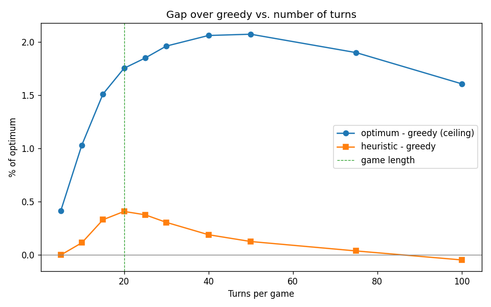

# Turns Analysis - Is the Gap Turn-Bound or Roster-Bound?

Each row is **1,000** paired seeded games at the given turn count. `gap %` is `(optimum - greedy) / optimum`; `heur %` is `(heuristic - greedy) / optimum`.

| Turns | Greedy | Optimum | opt-greedy | gap % | heur % |
|---:|---:|---:|---:|---:|---:|
| 5 | 279,056 | 280,214 | 1,158 | 0.41% | -0.00% |
| 10 | 538,254 | 543,866 | 5,613 | 1.03% | 0.11% |
| 15 | 780,093 | 792,062 | 11,968 | 1.51% | 0.33% |
| 20 | 1,007,278 | 1,025,256 | 17,978 | 1.75% | 0.41% |
| 25 | 1,219,885 | 1,242,876 | 22,991 | 1.85% | 0.38% |
| 30 | 1,420,347 | 1,448,770 | 28,423 | 1.96% | 0.31% |
| 40 | 1,791,677 | 1,829,393 | 37,716 | 2.06% | 0.19% |
| 50 | 2,131,341 | 2,176,473 | 45,133 | 2.07% | 0.13% |
| 75 | 2,869,922 | 2,925,524 | 55,602 | 1.90% | 0.04% |
| 100 | 3,495,638 | 3,552,748 | 57,110 | 1.61% | -0.05% |

## Takeaways

- The relative gap rises, **peaks around 50 turns at ~2.07%**, then declines. Beyond the peak, the valuable QBs are used up and extra turns add only near-zero scrubs, diluting the percentage.
- So the small gap is **roster-bound, not turn-bound** - a longer game does not create meaningful new headroom. It reflects that the top QBs are concentrated and rarely leave greedy badly trapped.
- The opportunity-cost heuristic's edge **peaks early and goes negative at high turn counts**: with many turns remaining it over-saves multi-team QBs (the `p_k` term saturates and the opportunity cost sums over every team a QB played for). This is the concrete signal to tune it (`sum` -> `max`, saner `p_k`).
