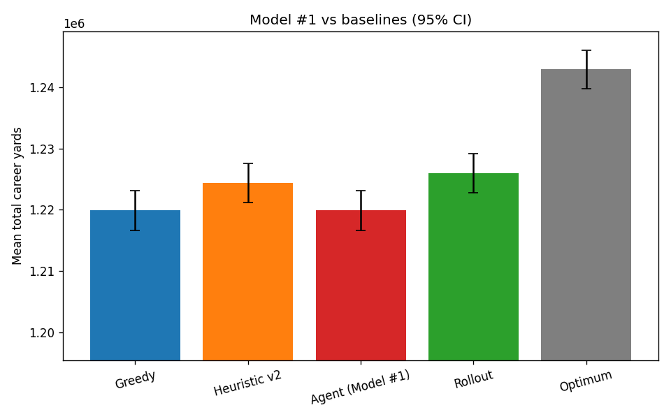
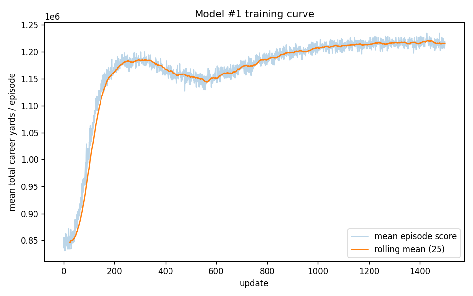

# Phase 2 - Model #1 (Agent v1): engineered save-value, PyTorch REINFORCE

Paired benchmark over **1,000** seeded games (every policy and the optimum see the same 25-team sequence per seed). The agent plays deterministically (argmax). Score = total career passing yards.

## Mean score (95% CI)

| Policy | Mean score | % of optimum | % of greedy->optimum gap |
|---|---|---|---|
| Greedy | 1,219,885 ± 3,193 | 98.15% | 0% (baseline) |
| Opportunity-cost (v2) | 1,224,422 ± 3,196 | 98.52% | 19.7% |
| **Agent (Model #1)** | 1,219,885 ± 3,193 | 98.15% | 0.0% |
| Rollout (online) | 1,225,985 ± 3,217 | 98.64% | 26.5% |
| Offline optimum | 1,242,876 ± 3,176 | 100.00% | 100% |

- Agent beats greedy in **0.0%** of games; captures **0.0%** of the greedy->optimum gap (heuristic 19.7%, rollout 26.5%).

## Inference speed (mean ms per decision)

| Policy | ms / decision |
|---|---|
| Heuristic v2 | 0.0559 |
| **Agent (Model #1)** | 0.1437 |
| Rollout | 0.2445 |

- The agent decides in **0.1437 ms** vs the rollout's **0.2445 ms** (**2x** faster), but captures only **0.0%** of the gap - the speed advantage is moot until it beats greedy.

