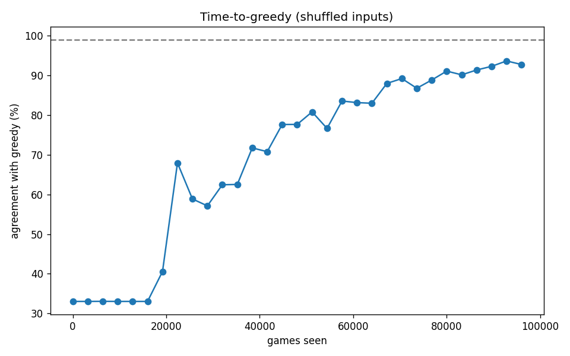

# Phase 2 - Time-to-greedy + save-attention over training (shuffled inputs)

Probed 31 checkpoints over a shuffled-input run; 200 held-out games each (states advanced by greedy, candidate order shuffled per game).

- Did not reach 99% greedy-agreement within this run.
- Peak save-feature ablation dP over training: **2.26e-02** (final **1.91e-02**).

